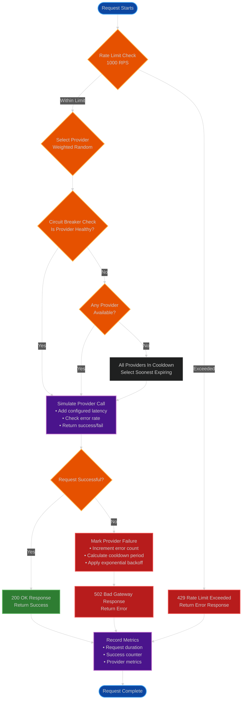
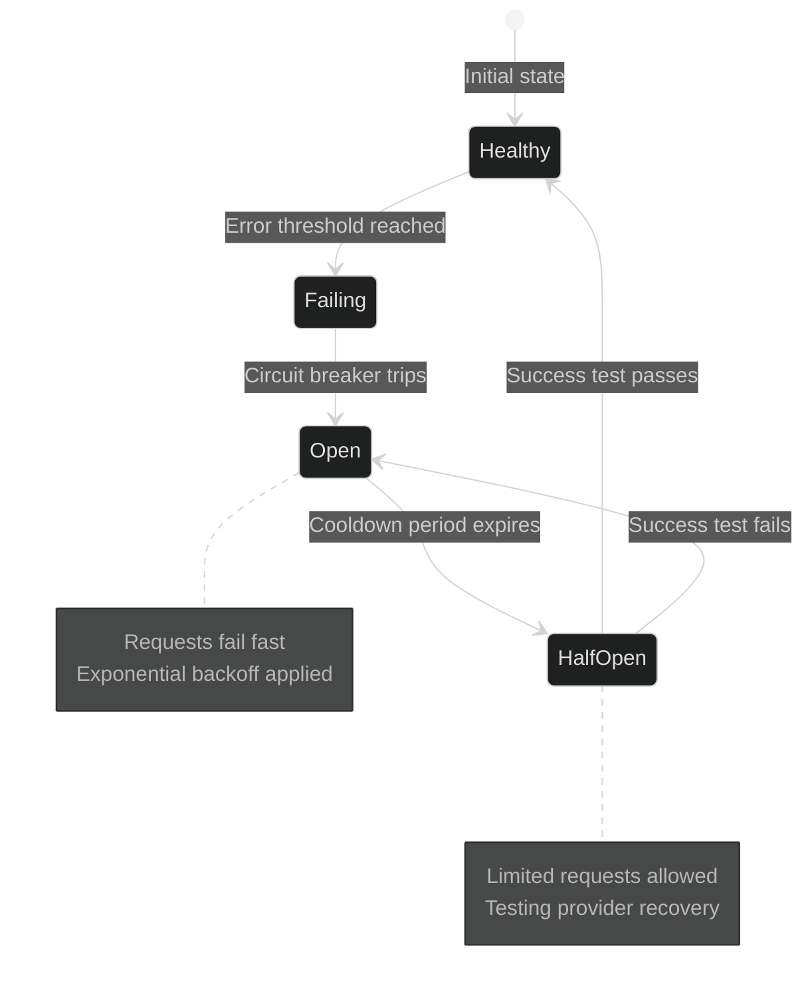

# API Gateway Simulator

A comprehensive Go-based API gateway simulator that demonstrates production-grade patterns including rate limiting, load balancing, circuit breaker, and metrics collection.

## Architecture Overview

```mermaid
%%{init: {'theme': 'dark'}}%%
graph TB
    %% Client Layer
    subgraph "Client Layer"
        C1[Client Simulator<br/>100 concurrent clients]
        C2[HTTP Requests<br/>/chat/completions]
    end

    %% API Gateway Layer
    subgraph "API Gateway (Port 8080)"
        RL[Rate Limiter<br/>Token Bucket<br/>1000 RPS]
        LB[Load Balancer<br/>Weighted Random<br/>P1:70% P2:20% P3:10%]
        CB[Circuit Breaker<br/>Exponential Backoff<br/>Health Monitoring]
        GW[Gateway Handler<br/>Request Processing]
    end

    %% Provider Layer
    subgraph "Provider Services"
        P1[Provider 1<br/>Latency: 100ms<br/>Error Rate: 5%<br/>Weight: 70]
        P2[Provider 2<br/>Latency: 500ms<br/>Error Rate: 10%<br/>Weight: 20]
        P3[Provider 3<br/>Latency: 2s<br/>Error Rate: 20%<br/>Weight: 10]
    end

    %% Metrics Layer
    subgraph "Metrics & Monitoring"
        M1[Prometheus Metrics<br/>Port 9090]
        M2[Request Counters<br/>Success/Error Rates]
        M3[Latency Histograms<br/>Provider Health]
        M4[Rate Limit Hits<br/>Circuit Breaker Status]
    end

    %% Flow Connections
    C1 --> C2
    C2 --> RL

    RL -->|Within Limit| LB
    RL -->|Rate Limited| ERR429[429 Rate Limit<br/>Exceeded]

    LB --> CB
    CB -->|Healthy| GW
    CB -->|In Cooldown| COOLDOWN[Select Soonest<br/>Expiring Provider]

    GW --> P1
    GW --> P2
    GW --> P3
    COOLDOWN --> P1
    COOLDOWN --> P2
    COOLDOWN --> P3

    P1 -->|Success| RESP200[200 OK Response]
    P2 -->|Success| RESP200
    P3 -->|Success| RESP200

    P1 -->|Error| MARK_FAIL[Mark Provider Failure<br/>Increment Error Count<br/>Apply Backoff]
    P2 -->|Error| MARK_FAIL
    P3 -->|Error| MARK_FAIL

    MARK_FAIL --> RESP502[502 Bad Gateway<br/>Response]

    RESP200 --> M1
    RESP502 --> M1
    ERR429 --> M1

    M1 --> M2
    M1 --> M3
    M1 --> M4

    %% Styling
    classDef clientClass fill:#1e3a5f,stroke:#4fc3f7,stroke-width:2px
    classDef gatewayClass fill:#3e2723,stroke:#ff8a65,stroke-width:2px
    classDef providerClass fill:#1b5e20,stroke:#81c784,stroke-width:2px
    classDef metricsClass fill:#4a148c,stroke:#ba68c8,stroke-width:2px
    classDef errorClass fill:#b71c1c,stroke:#ef5350,stroke-width:2px
    classDef successClass fill:#2e7d32,stroke:#66bb6a,stroke-width:2px

    class C1,C2 clientClass
    class RL,LB,CB,GW gatewayClass
    class P1,P2,P3 providerClass
    class M1,M2,M3,M4 metricsClass
    class ERR429,RESP502,MARK_FAIL errorClass
    class RESP200 successClass
```

## Detailed Request Flow

## Circuit Breaker State Machine

## Key Components Explanation

### Rate Limiter (Token Bucket)
- **Algorithm**: Token bucket with 1000 tokens capacity
- **Refill Rate**: 1000 tokens per second
- **Behavior**: Allows bursts up to capacity, smooths traffic

### Load Balancer (Weighted Random)
- **Provider 1**: 70% traffic (fast, reliable)
- **Provider 2**: 20% traffic (medium latency)
- **Provider 3**: 10% traffic (slow, less reliable)
- **Selection**: Weighted random distribution

### Circuit Breaker (Exponential Backoff)
- **Failure Threshold**: Configurable error count
- **Cooldown**: 2^failures * base_delay seconds
- **Recovery**: Half-open state for testing

### Metrics (Prometheus)
- **Counters**: Total requests, successes, errors, rate limits
- **Histograms**: Request latency, provider response times
- **Gauges**: Active connections, circuit breaker states

### Provider Simulation
- **Latency**: Configurable response delays
- **Error Rates**: Configurable failure percentages
- **Behavior**: Realistic API provider simulation

## Features

- **Rate Limiting**: Token bucket algorithm supporting 1000 requests per second
- **Load Balancing**: Weighted random distribution across 3 providers (70%/20%/10%)
- **Circuit Breaker**: Exponential backoff for fault tolerance and recovery
- **Metrics**: Comprehensive Prometheus metrics for monitoring
- **Concurrent Simulation**: 100 goroutines generating realistic traffic patterns
- **Health Monitoring**: Automatic provider health tracking and recovery

## API Endpoints

- `POST /chat/completions` - Main API endpoint (Port 8080)
- `GET /metrics` - Prometheus metrics endpoint (Port 9090)

## Getting Started

1. Clone the repository
2. Run `go mod tidy` to install dependencies
3. Run `go run main.go` to start the simulator
4. Access the API at `http://localhost:8080`
5. View metrics at `http://localhost:9090`

## Technologies Used

- **Go**: Programming language with goroutines for concurrency
- **Gin**: HTTP web framework
- **Prometheus**: Metrics collection and monitoring
- **Atomic Operations**: Thread-safe rate limiting implementation</content>
<parameter name="filePath">/Users/ranjanyadav/Desktop/Learning Projects/README.md